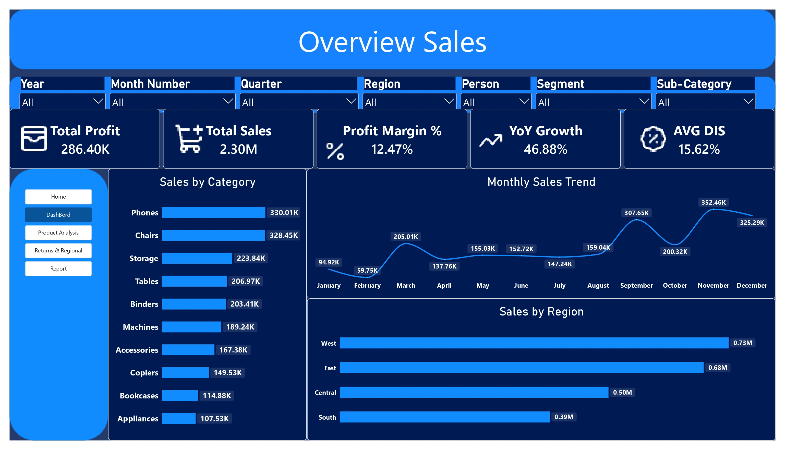
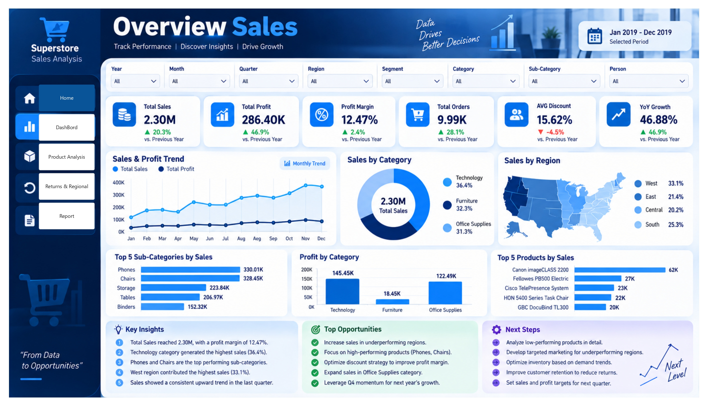
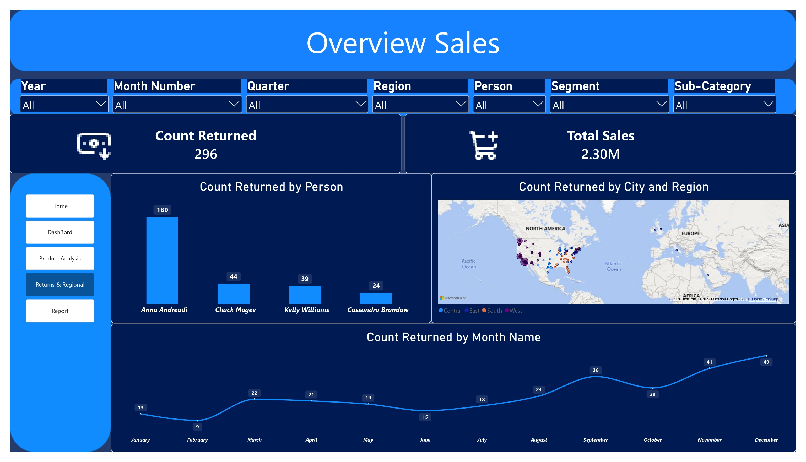
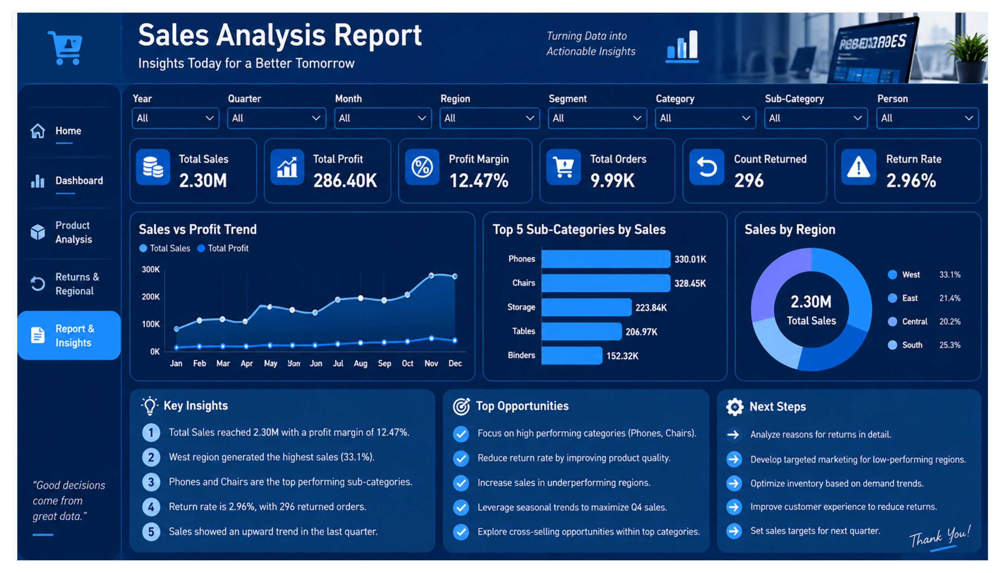

# 📊  Superstore 2019 – Sales Analysis

A Power BI sales analysis project based on the Sample Superstore 2019 dataset.

In this project, I worked with sales data to understand the overall business performance, including sales, profit, products, regions, customers, and returned orders.

I prepared the data, analyzed the main business metrics, and created interactive Power BI dashboards to present the results in a clear and simple way.

---

## 🎯 Project Objective

The main goal of this project was to analyze the sales data and understand the overall business performance.

The analysis focuses on:

- 💰 Sales and profit performance
- 📈 Monthly and yearly sales trends
- 📦 Product and sub-category performance
- 🌎 Sales performance by region
- 👥 Customer and segment performance
- 🔄 Returned orders and return rate
- 📊 Key business performance indicators

---

## 🔧 What I Worked On

### 🧹 Data Preparation

I started by preparing the sales data before building the Power BI report.

I reviewed the dataset structure and prepared the required fields for analysis and visualization.

The preparation included:

- 🔍 Reviewing the dataset and available columns
- 📅 Checking date-related fields
- 💰 Preparing sales and profit data
- 🏷️ Preparing category and sub-category information
- 👥 Preparing customer and segment information
- 🌎 Preparing regional information
- 🔄 Preparing return-related data

---

### 💰 Sales & Profit Analysis

I analyzed the main sales and profitability metrics to get a clear view of the business performance.

The analysis includes:

- 💰 Total Sales
- 💵 Total Profit
- 📊 Profit Margin
- 📈 YoY Growth
- 🏷️ Average Discount
- 🧾 Total Orders

These KPIs provide a quick overview of the overall business performance.

---

### 📊 Profit Margin

Profit Margin was used to understand the relationship between profit and total sales.

It shows how much profit was generated compared with the total sales.

**Profit Margin = Total Profit ÷ Total Sales**

---

### 📈 Sales Trend Analysis

I analyzed sales over time to understand how sales changed across different months and years.

This helped me identify changes in sales performance and observe the overall sales trend.

---

### 📦 Product & Sub-Category Analysis

I analyzed categories, sub-categories, and individual products to understand which products generated higher sales.

The analysis includes:

- 📦 Sales by Category
- 🏷️ Sales by Sub-Category
- 💰 Profit by Category
- 🏆 Top Products by Sales
- 📊 Sales vs Profit by Sub-Category

---

### 🌎 Regional Analysis

I compared sales performance across different regions.

This helps show how sales are distributed across the business and which regions contribute more to total sales.

---

### 👥 Customer & Segment Analysis

I also looked at customer and segment performance to understand how sales are distributed between different customer groups.

This includes analyzing sales performance by customer segment and identifying high-performing customers.

---

### 🔄 Returns Analysis

Returned orders were analyzed to understand the level and distribution of returns.

The analysis includes:

- 🔄 Count of Returned Orders
- ⚠️ Return Rate
- 👤 Returned Orders by Person
- 🏙️ Returned Orders by City
- 🌎 Returned Orders by Region
- 📅 Returned Orders by Month

This provides a clearer view of where returned orders occurred and how they were distributed.

---

# 📊 Dashboard

The project contains several Power BI pages, with each page focusing on a different part of the sales analysis.

## 🖼️ Project Preview

---

## 1️⃣ Overview Sales

The Overview Sales page provides a general view of the business performance.

It brings the main KPIs and important sales information together in one page.

### 📌 Main KPIs

- 💰 **Total Sales** — Shows the total sales generated.
- 💵 **Total Profit** — Shows the total profit generated.
- 📊 **Profit Margin** — Shows profit compared with total sales.
- 📈 **YoY Growth** — Shows the change in sales compared with the previous year.
- 🏷️ **Average Discount** — Shows the average discount applied.

### 📈 Charts & Analysis

The page includes:

- 📅 Monthly Sales Trend
- 📦 Sales by Category
- 🌎 Sales by Region
- 🏆 Top Sub-Categories by Sales
- 🥇 Top Products by Sales

This page provides a quick overview of the overall sales performance.

---

## 2️⃣ Product Analysis

The Product Analysis page focuses on product and sub-category performance.

It helps compare different products and sub-categories based on sales and profit.

### 📊 Analysis Included

- 📦 Sales by Sub-Category
- 💰 Profit by Category
- 🏆 Top Products by Sales
- 📊 Sales vs Profit by Sub-Category

This page helps identify products and sub-categories that contribute more to sales and profit.

---

## 3️⃣ Returns & Regional Analysis

This page focuses on returned orders and their distribution across different locations.

Instead of looking only at the total number of returns, I analyzed the returns by different dimensions.

### 🔄 Analysis Included

- 🔄 Count of Returned Orders
- 👤 Returned Orders by Person
- 🏙️ Returned Orders by City
- 🌎 Returned Orders by Region
- 📅 Returned Orders by Month

This makes it easier to understand where returned orders occurred and how they changed over time.

---

## 4️⃣ Sales Analysis Report

The final report summarizes the main results of the sales analysis.

It combines important KPIs, charts, and business findings into one report.

### 📋 Report Includes

- 💰 Total Sales
- 💵 Total Profit
- 📊 Profit Margin
- 🧾 Total Orders
- 🔄 Returned Orders
- ⚠️ Return Rate
- 📈 Sales vs Profit Trend
- 🏆 Top Sub-Categories
- 🌎 Sales by Region
- 💡 Key Insights

---

# 📌 Key Results

The dashboard shows the following main results:

| KPI | Result |
|---|---:|
| 💰 Total Sales | **2.30M** |
| 💵 Total Profit | **286.40K** |
| 📊 Profit Margin | **12.47%** |
| 📈 YoY Growth | **46.88%** |
| 🧾 Total Orders | **9.99K** |
| 🔄 Returned Orders | **296** |
| ⚠️ Return Rate | **2.96%** |

---

# 💡 Key Insights

Some of the main findings from the analysis include:

- 🌎 The **West** region generated the highest share of sales at **33.1%**.
- 📦 **Phones** and **Chairs** were among the top-performing sub-categories by sales.
- 🔄 The dashboard recorded **296 returned orders**.
- 📈 Sales showed an upward trend toward the last quarter.
- 💰 Total sales reached **2.30M**, with a **12.47% profit margin**.

---

# 🛠️ Tools Used

- 📊 **Microsoft Power BI** — Dashboard development and data visualization
- 📗 **Microsoft Excel** — Working with the source sales data
- 🔄 **Power Query** — Data preparation and transformation

---

# 🔄 Workflow

The project followed this workflow:

🎛️ Interactive Dashboard
   ↓
💡 Business Insights
